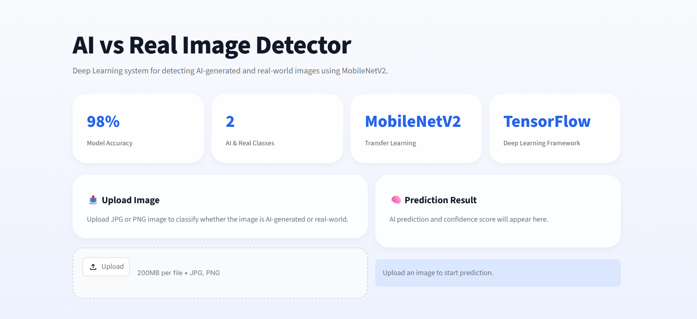

# AI-Generated vs Real Image Classification Using Deep Learning

A Deep Learning-based Computer Vision project for detecting whether an image is AI-generated or a real-world photograph using MobileNetV2 and TensorFlow.

---

## Project Overview

This project aims to classify images into two categories:

* AI-Generated Images
* Real Images

The model is built using Transfer Learning with MobileNetV2 and deployed using Streamlit with a modern dashboard-style interface.

---

## Features

* AI vs Real image classification
* Transfer Learning with MobileNetV2
* Modern Streamlit Dashboard UI
* Confidence score prediction
* Image upload functionality
* Responsive interface
* Model evaluation visualization
* Deployment-ready structure

---

## Tech Stack

### Machine Learning

* Python
* TensorFlow / Keras
* MobileNetV2
* Scikit-learn
* NumPy

### Deployment

* Streamlit

### Visualization

* Matplotlib
* Confusion Matrix
* Classification Report

---

## Dataset

Dataset used:
**AI vs Real Images Dataset**

The dataset contains:

* Real-world images from Unsplash
* AI-generated images from Stable Diffusion

Categories include:

* Animals
* City
* Food
* Nature
* People

---

## Project Structure

```text
AI-vs-Real-Image/
│
├── app/
│   ├── streamlit_app.py
│   └── style.css
│
├── dataset/
│   └── final_dataset/
│
├── model/
│   └── mobilenetv2_model.h5
│
├── src/
│   ├── split_dataset.py
│   ├── train_model.py
│   ├── evaluate_model.py
│   └── predict.py
│
├── assets/
│
├── requirements.txt
├── README.md
└── .gitignore
```

---

## Installation

Clone the repository:

```bash
git clone https://github.com/your-username/AI-vs-Real-Image.git
```

Move into the project folder:

```bash
cd AI-vs-Real-Image
```

Create virtual environment:

### Windows

```bash
python -m venv venv
```

Activate virtual environment:

```bash
venv\Scripts\activate
```

Install dependencies:

```bash
pip install -r requirements.txt
```

---

## Dataset Preparation

Place the dataset into:

```text
dataset/
├── Ai_generated_dataset/
└── real_dataset/
```

Run dataset splitting:

```bash
python src/split_dataset.py
```

---

## Model Training

Train the MobileNetV2 model:

```bash
python src/train_model.py
```

The trained model will be saved in:

```text
model/mobilenetv2_model.h5
```

---

## Model Evaluation

Evaluate model performance:

```bash
python src/evaluate_model.py
```

Evaluation includes:

* Accuracy
* Precision
* Recall
* F1-Score
* Confusion Matrix

---

## Dashboard Preview



---

## Run Streamlit App

Move into app directory:

```bash
cd app
```

Run the app:

```bash
streamlit run streamlit_app.py
```

---

## Model Architecture

This project uses:

* MobileNetV2
* Transfer Learning
* Binary Classification
* Sigmoid Activation
* Data Augmentation

---

## Streamlit Dashboard

The application provides:

* Modern dashboard UI
* Image upload interface
* AI detection result
* Confidence score
* Responsive layout

---

## Future Improvements

* Grad-CAM visualization
* Real-time webcam detection
* Multi-class AI generator detection
* Model comparison dashboard
* Fine-tuning MobileNetV2
* Docker deployment

---

## Deployment

This project can be deployed for free using:

* [Streamlit Community Cloud](https://streamlit.io/cloud?utm_source=chatgpt.com)

---

## Results

Example evaluation metrics:

| Metric    | Score |
| --------- | ----- |
| Accuracy  | 98%   |
| Precision | 97%   |
| Recall    | 98%   |
| F1-Score  | 97%   |

---

## Author

Zulfianti Rahmawati Ashilah

---

## License

This project is intended for educational and portfolio purposes.
